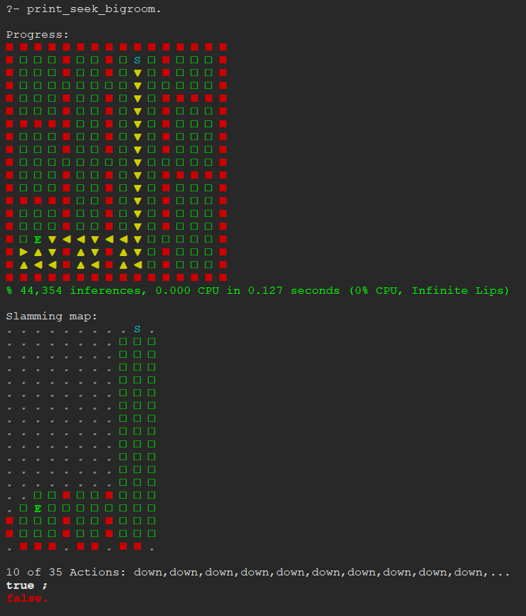
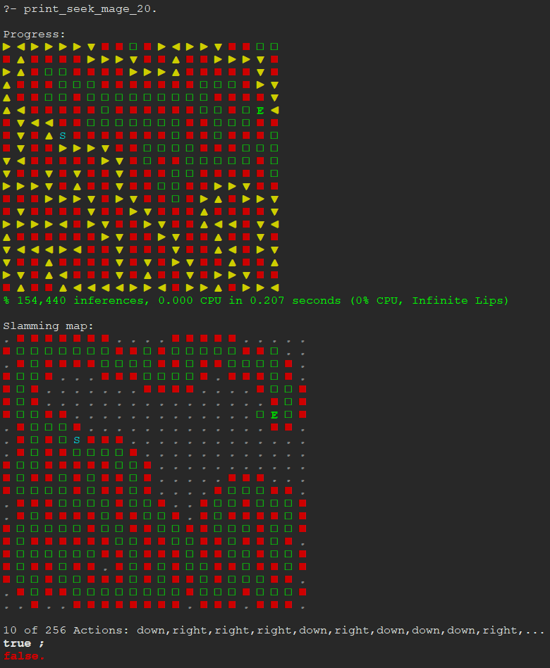

IJCLR 2024 Experiments 
=======================

Install SWI-Prolog
------------------

Download and install the development version of SWI-Prolog, from the following
url:

`https://www.swi-prolog.org/download/devel`

Experiments in this repository were run with SWI-Prolog 9.3.0. Later versions
of SWI-Prolog introduced a bug that causes the experiments to run. These were
fixed in a development version before 01/08/24 but changes may not have been
included in the stable version at the time when you download SWI-Prolog. If
there are memory-related errors when you run the experiments make sure to set
your SWI-Prolog version to 9.3.0.

Get the experiments' code and data
----------------------------------

Clone this repository from github. You will probably know how to do this but
just in case:

```
git clone git@github.com:stassa/ijclr_204_experiments.git
```

That will create a directory `ijclr_2024_experiments.git` in the directory where
you run the above command. Instructions below assume paths are relative to that
directory.


Load Louise and experiment scripts
----------------------------------

To run the experiments start Louise by consulting `louise/load_headless.pl` or
`louise/load_project.pl` if you want to start the SWI-Prolog IDE.

Experiments are run by calling two test scripts in the following paths 
(where `ijclr_204_experiments.git/` is the root directory of the cloned repository):

```
ijclr_204_experiments.git/louise/lib/grid_master/data/scripts/ijclr_2024_experiment_1a.pl
ijclr_204_experiments.git/louise/lib/grid_master/data/scripts/ijclr_2024_experiments_1b-2x.pl
```

The first script, `ijclr_2024_experiment_1a.pl`, runs the experiment listed in
the first row of Table 2 in th epaper, in the row titled "Experiment 1 Solver".

The second script, `ijclr_2024_experiments_1b-2x.pl`, runs all remaining
experiments. The naming of the experiments in the script files correspond to the
experiments listed in Table 2 as follows:

```
Experiment Script predicate     Table 2 row
experiment_1a                 Experiment 1 Solver MaGe map (row 1)
experiment_1b                 Experiment 1 Solver Lake map (row 2)
experiment_2a                 Experiment 2 FSC-BT MaGe map (row 3)
experiment_2b                 Experiment 2 FSC-RE MaGe map (row 4)
experiment_2c                 Experiment 2 FSC-BT(S) MaGe map (row 5) 
experiment_2d                 Experiment 2 FSC-RE(S) MaGe map (row 6) 
```

In the following, we refer to experiments by their names in the Experiment
script predicate colunn above.

Make a test run
---------------

Experiments can take a while so it's a good idea to test that everything runs
correctly, first.

There are two experiment scripts. Test them in order as shown below.

The experiment scripts write log files under the `louise/` directory, that hold
the results of the experiments.

### experiment 1a

In the SWI-Prolog console enter the following queries. The output should be as
listed:

```
?- ensure_loaded(lib/grid_master/data/scripts/ijclr_2024_experiment_1a).
Loading large primitives file. Be patient.
true.

?- experiment_1a.
Starting experiment_1a
Global stack limit 2,147,483,648
Table space 17,179,869,184
Warning: trace_map_solver: no matching debug topic (yet)
% Solving map mage_1
% 375,391 inferences, 1.172 CPU in 2.549 seconds (46% CPU, 320334 Lips)
% Solved instance with 398 actions in 1.7834 sec: 
% s([mage_1,67/34,s],[mage_1,78/11,e])
% Solving map mage_2
% 487,431 inferences, 1.562 CPU in 3.323 seconds (47% CPU, 311956 Lips)
% Solved instance with 476 actions in 1.2500 sec: 
% s([mage_2,87/65,s],[mage_2,96/4,e])
% Solving map mage_3
% 3,759,746 inferences, 23.312 CPU in 28.074 seconds (83% CPU, 161276 Lips)
% Solved instance with 460 actions in 1.7709 sec: 
% s([mage_3,93/71,s],[mage_3,33/89,e])
% Solving map mage_4
% 181,995 inferences, 1.047 CPU in 1.315 seconds (80% CPU, 173846 Lips)
% Solved instance with 148 actions in 0.0683 sec: 
% s([mage_4,78/87,s],[mage_4,88/89,e])
% Solving map mage_5
% 504,496 inferences, 3.156 CPU in 3.498 seconds (90% CPU, 159840 Lips)
% Solved instance with 546 actions in 0.4511 sec: 
% s([mage_5,36/22,s],[mage_5,19/55,e])
% Solving map mage_6
% 3,378,675 inferences, 15.219 CPU in 25.266 seconds (60% CPU, 222007 Lips)
% Solved instance with 1709 actions in 1.2156 sec: 
% s([mage_6,58/52,s],[mage_6,81/80,e])
% Solving map mage_7
% 610,379 inferences, 2.297 CPU in 4.713 seconds (49% CPU, 265743 Lips)
% Solved instance with 724 actions in 1.7322 sec: 
% s([mage_7,91/15,s],[mage_7,51/99,e])
% Solving map mage_8
% 3,996,861 inferences, 13.562 CPU in 31.357 seconds (43% CPU, 294699 Lips)
% Solved instance with 166 actions in 2.6523 sec: 
% s([mage_8,99/53,s],[mage_8,98/94,e])
% Solving map mage_9
% 3,325,127 inferences, 11.766 CPU in 24.675 seconds (48% CPU, 282614 Lips)
% Solved instance with 1681 actions in 1.7330 sec: 
% s([mage_9,73/74,s],[mage_9,46/28,e])
% Solving map mage_10
% 557,146 inferences, 1.406 CPU in 4.008 seconds (35% CPU, 396193 Lips)
% Solved instance with 296 actions in 1.2905 sec: 
% s([mage_10,50/34,s],[mage_10,25/57,e])
Solved 10 MaGe maps. Mean number of steps: 660.40
true.

```

### Experiments 1b - 2d:

In the SWI-Prolog console enter the following queries. The output should be as
listed:


```
?- ensure_loaded(lib/grid_master/data/scripts/'ijclr_2024_experiments_1b-2x.pl').
true.

?- run_experiments.
Global stack limit 2,147,483,648
Table space 17,179,869,184
% Solving Dungeon dungeon_1 instance 1
% Solving Dungeon dungeon_2 instance 1
Solved 2 Dungeon maps. Mean number of steps: 12.50Starting experiment_2a
% Solving map mage_1
Solved 1 MaGe maps with backtracking executor. Mean number of steps: 398.00Starting experiment_2b
% Solving map mage_1
Solved 1 MaGe maps with reversing executor. Mean number of steps: 618.00Starting experiment_2d
% Solving Dungeon dungeon_1 instance 1
% Solving Dungeon dungeon_2 instance 1
Solved 2 Dungeon maps with reversing_slam executor. Mean number of steps: 34.50Starting experiment_2c
% Solving Dungeon dungeon_1 instance 1
% Solving Dungeon dungeon_2 instance 1
Solved 2 Dungeon maps with backtracking_slam executor. Mean number of steps: 52.00
true.
```

Run full experiments
--------------------

To run the full expeiments, with all maps, first you need to edit the two test
scripts to set the experiment options.

### Run experiment 1a

To edit the Experiment 1a script in the SWI-Prolog IDE, make the following query
at the SWI-Prolog top-level:

```
?- edit(lib/grid_master/data/scripts/ijclr_2024_experiment_1a).
true.
```

Otherwise, edit the file listed above in your favourite texte editor or IDE.

In that file, make sure to set the following option:

```
mage_maps(100).
```

This will allow experiment 1a to be run with all 100 MaGe geneated maps.

To run the experiment, make the same query as in the test run: 

```
?- experiment_1a.
```

This time you should see a lot more output. 


### Run experiments 1b - 2d

Same as for experiment 1a, edit the experiment script for this set of
experiments in the SWI-Prolog IDE:

```
?- edit(lib/grid_master/data/scripts/'ijclr_2024_experiments_1b-2x.pl').
true.
```

Or use your favourite text editor or IDE.

Make sure the following options are as listed:

```
mage_maps(100).

dungeon_maps(10).

dungeon_instances(50).
```

Setting the above options as shown will allow experiments 1b to 2d to run with
all 100 MaGe maps and all 500 lake maps ("dungeons" in the experiment script).

As for experiment 1a, you should see a lot more output this time.


Paper
=====

A draft of the paper submitted to IJCLR is included under the `paper/`
directory, as a pdf file. The version of the paper in that directory includes
corrections and supplements not included in the submitted version.


Additional test scripts
=======================

You can further test the capabilities of Grid Mater and Controller Freak, the
two systems described in the IJCLR submission, by running the test script in the
following path:

```
ijclr_2024_experiments/louise/lib/grid_master/data/scripts/test_scripts.pl
```

Where `ijclr_2024_experiments` is the top-level directory where you cloned this
repository.

The scripts in `test_scripts.pl` are grouped by the method of display: either by
printing out results in the SWI-Prolog IDE once processing is finished, or by
printing results in real-time, using the Python library
[blessed](https://pypi.org/project/blessed/), via SWI-Prolog's built-in Janus
interface.

Look for the comments in `test_script.pl` preceding each group of scripts to
find out which display method is used by that group, and the purpose of the
scripts in the group. 

For example the first group of scripts in `test_script.pl` is preceded by the
following comment block:

```
/* ================================================================================
 * Seek a target already marked on a map.
 * Display with blessed.
================================================================================ */
```

Installing blessed
------------------

You need the `blessed` teminal manipulation Python package to run those scripts
in `test_scripts.pl` that display their results using, well, `blessed`.

Note that you don't need `blessed` unless you want to run the scripts that use
it.

You can install `blessed` according to the project's [online
instructions](https://pypi.org/project/blessed/). This basically amounts to
calling the pip Python package manager as follows:

```
pip install blessed
```

Once blessed is installed, the test scripts that use it should be run in a
terminal _not in the SWI-Prolog IDE_. 

If you try to run the blessed scripts in the SWI-Prolog IDE you sould expect to
see an error like the following:

```
?- seek_mage_20.
ERROR: Python 'AttributeError':
ERROR:   'NoneType' object has no attribute 'fileno'
ERROR: Python stack:
ERROR:   File "C:\Users\me\AppData\Roaming\Python\Python310\site-packages\blessed\terminal.py", line 164, in __init__
ERROR:     self.__init__streams()
ERROR:   File "C:\Users\me\AppData\Roaming\Python\Python310\site-packages\blessed\terminal.py", line 253, in __init__streams
ERROR:     self._init_descriptor = sys.__stdout__.fileno()
ERROR: 
ERROR: In:
ERROR:   [18] janus:py_call(blessed:'Terminal'(),_47066,[python_object(true)])
ERROR:   [17] basic_environment:environment_init(map(mageid,20-20,c(f,f,f,f,f,w,f,f,f,f,f,f,f,w,w,f,'<skipped 383 of 400>',f)),blessed,20-20,_47190-s,q0,pupu,_47196-e) at c:/users/me/documents/prolog/ilp_systems/ijclr_2024_experiments/louise/lib/grid_master/data/environments/basic_environment/basic_environment.pl:121
ERROR:   [14] search_map_terminal(id(mageid),blessed,20-20,s,e,tiles) at c:/users/me/documents/prolog/ilp_systems/ijclr_2024_experiments/louise/lib/grid_master/data/scripts/test_scripts.pl:724
ERROR:   [11] toplevel_call('<garbage_collected>') at c:/program files/swipl/boot/toplevel.pl:1318
ERROR: 
ERROR: Note: some frames are missing due to last-call optimization.
ERROR: Re-run your program in debug mode (:- debug.) to get more detail.
   Exception: (14) search_map_terminal(id(mageid), blessed, 20-20, s, e, tiles) ? creep
^  Exception: (4) setup_call_cleanup('$toplevel':notrace(call_repl_loop_hook(begin, 0)), '$toplevel':'$query_loop'(0), '$toplevel':notrace(call_repl_loop_hook(end, 0))) ? creep
```

Running the test scripts
------------------------

To run the test scripts, consult the test scripts file as follows, at the
SWI-Prolog top-level:

```
% cd to <repository_root>/louise/

% Start SWI-Prolog .e.g 
% > swipl

ensure_loaded(lib/grid_master/data/scripts/test_scripts).
```

Then find the nanme of the script you wish to run in `test_scripts.pl` and run
it by calling its name. Top-level script predicates take no arguments.

For example, to run a "seek" script on the "big room" map included with Grid
Master and display the results in the SWI-Prolog IDE at the end of processing,
you would enter the following query (and see the results illustrated in the
image below):




Or, to run the seek script as above but in a MaGe-generated maze, you would run
the following:




Configuring test scripts
------------------------

The test scripts in `test_script.pl` showcase various capabilities of the Grid
Master and Controller Freak libraries and so can be run with different
configurations of those systems.

Look at the auxiliary predicates in `test_script.pl` to get an idea of what the
test scripts do. See also the note near the top about different types of
"mission".

To configure Grid Master to run mission scripts with different settings, edit
the Grid Master configuration file in the following location:

```
ijclr_2024_experiments/louise/lib/grid_master/grid_master_configuration.pl
```

To configure Controller Freak for the same purppose, edit its configuration file
in the following location:

```
ijclr_2024_experiments/louise/lib/controller_freak/controller_freak_configuration.pl
```

For some of the test scripts you may need to edit both configuration files. 


Test scripts - disclaimer
-------------------------

Test scripts are not described in the IJCLR submission. They were used in the
development of the Grid Master and Controller Freak libraries and some of the
experiments in the IJCLR submission are based on them. The scripts are included
in this repository to satisify reviewers' (and other viewers') curiosity about
the project and its capabilities. Users are invited to experiment and "play
around" with the test scripts to find out how to use the two libraries.

Please contact the corresponding author (owner of this repository) if you have
trouble running the scripts.
